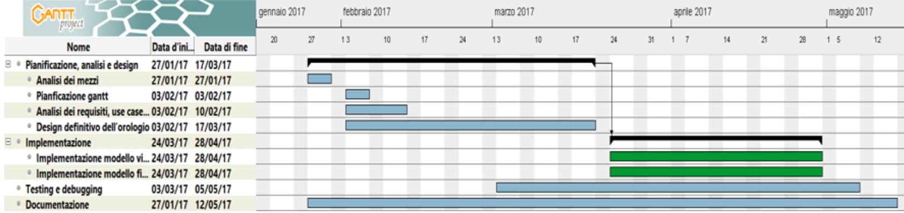

# Word Clock

1. [Introduzione](#introduzione)

  - [Informazioni sul progetto](#informazioni-sul-progetto)

  - [Abstract](#abstract)

  - [Scopo](#scopo)

2. [Analisi](#analisi)

  - [Analisi del dominio](#analisi-del-dominio)

  - [Analisi e specifica dei requisiti](#analisi-e-specifica-dei-requisiti)

3. [Use case](#use-case)

  - [Pianificazione](#pianificazione)

  - [Analisi dei mezzi](#analisi-dei-mezzi)

4. [Progettazione](#progettazione)

  - [Design dell’architettura del sistema](#design-dell’architettura-del-sistema)

  - [Design dei dati e database](#design-dei-dati-e-database)

5. [Implementazione](#Implementazione)

  - [Sviluppo](#Sviluppo)

  - [Test](#Test)

  - [Protocollo di test](#Protocollo-di-test)

  - [Risultati test](#Risultati-test)

  - [Mancanze/limitazioni conosciute](#Mancanze/limitazioni-conosciute)

6. [Consuntivo](#Consuntivo)

7. [Conclusioni](#Conclusioni)

  - [Sviluppi futuri](#Sviluppi-futuri)

  - [Considerazioni personali](#Considerazioni-personali)

8. [Bibliografia](#Bibliografia)

  - [Sitografia](#Sitografia)

9. [Allegati](#Allegati)

## Introduzione

### Informazioni sul progetto

Scuola SAMT - Scuola arti e mestieri Trevano

Sezione: Informatica

Materia: Modulo 306

Allievi:

- Fabio Gola
- Alessandro Gomes

Docente responsabile:

- Adriano Barchi

Data di inizio: 16.03.2017

Data di fine: 18.05.2017

### Abstract

  > You don't know what time is it, but you don't have a clock?
  > This clock represented by words is here for you.
  > We created a simple and clean design for give you an easy
  > and fast read of it.
  > In this way you don't have anymore the need to ask it to anybody else.
  > This WordClock won't be the helpful clock that you may need, but it will
  > surely be the greatest and coolest you have ever seen!
  > Anywhere you'll put it will always be gorgeous to look at.

### Scopo

Lo scopo del progetto è quello di realizzare un orologio a parole. Questo dovrà
essere presente in due modelli, uno fisico ed uno virtuale. Su quello fisico
verrà mostrata l'ora scritta con delle parole retroilluminate, questo sarà
controllato da quello virtuale sul quale verrà mostrata l'ora come nel modello
fisico. La parte fisica deve sincronizzarsi alla parte virtuale tramite Wi-Fi.

## Analisi

### Analisi del dominio

Con la tecnologia si fanno sempre più progressi, per questo con il tempo
gli orologi analogici non verranno più utilizzati.
L'utilizzo del digitale sta avendo il soppravento e quindi per le strade o
nelle strutture come case ed uffici possiamo trovare un orologio numerico.

Il prodotto comprende una lettura diversa dal solito poiché l'ora verrà espressa
a parole, questo sarà accessibile a chiunque.

### Analisi e specifica dei requisiti

  |ID  | REQ-001                                         |
  |:----|:------------------------------------------------|
  |**Nome**    |Ergonomia |
  |**Priorità** | 1                     |
  |**Versione** | 1.0                   |
  |**Note**    | |
  |            |**Sotto requisiti** |
  |**001**  | L’orologio dovrà mostrare le ore in italiano secondo il modo di espressione corrente  |
  |**002**  | La posizione delle parole dovrà essere ottimizzata per una facile lettura   |
  |**003**  | Dovrà avere una risoluzione minima di cinque minuti   |
  |**004**  | L’intervallo tra i cinque minuti dovrà essere mostrato con una rappresentazione grafica intuitiva, risoluzione minima di un minuto.  |

  |ID  |REQ-002                                         |
  |:----|:------------------------------------------------|
  |**Nome**    |Modello fisico |
  |**Priorità** |1                     |
  |**Versione** |1.0                   |
  |**Note**    ||
  |            |**Sotto requisiti** |
  |**001**  | Il sistema di controllo del display a parole dovrà comunque già essere dimensionato, oppure prevedere un’espansione, per controllare un modello più grande di ca. 2m x 2m  |
  |**002**  | Il modello fisico dovrà essere alimentato autonomamente ed essere sincronizzato automaticamente (tramite Wi-Fi sui diversi time server a disposizione)  |
  |**003**  | In caso di interruzione di alimentazione, un RTC alimentato a batteria dovrà mantenere l’ora sincronizzata in modo che al ritorno dell’alimentazione, l’orologio sia già corretto  |
  |**004**  | Il modello fisico dovrà poter essere controllato (accensione, correzione dell’ora) anche direttamente onboard  |
  |**005**  | Il sistema di accenzione delle parole verra implementato utilizzando un Led stripes NeoPixel  |

  |ID  |REQ-003                                         |
  |:----|:------------------------------------------------|
  |**Nome**    |Modello virtuale |
  |**Priorità** |1                     |
  |**Versione** |1.0                   |
  |**Note**    ||
  |            |**Sotto requisiti** |
  |**001**  | Il modello virtuale dovrà avere la stessa rappresentazione grafica di quello fisico |
  |**002**  | Sincronizzazione con il modello fisico |
  |**003**  | Tramite un accesso ristretto dovrà permettere di controllare il modello fisico e di testarne l’integrità permettendo l’accensione simultanea di tutti i led   |

### Use case

In questo schema abbiamo rappresentato tutti i rispettivi casi dell'applicativo
web (modello virtuale).

Lo use case presenta tre attori principali: il sito, l'amministratore e l'utente ospite.

Il primo attore è il sito che fornirà al modello fisico e all'utente ospite l'orario, inoltre, quest'ultimo avrà il controllo sul modello fisico.

Il secondo potrà testare i led del modello fisico e modificarne pure l'orario, ma per fare ciò dovrà prima eseguire il login da amministratore sul sito.

Il terzo attore é l'utente ospite che potrà leggere l'orario fornito dal primo attore, il sito.

In questo schema abbiamo rappresentato tutti i rispettivi casi dell'applicativo web (modello virtuale).

### Pianificazione

### Analisi dei mezzi

Questo prodotto sarà compreso in un costrutto di legno per il modello fisico, ed
in un web server per il modello virtuale.   

I mezzi per realizzare il tutto sono i seguenti:

- Arduino Ethernet: per il funzionamento del modello fisico

- Alimentatore 12 V e 5 A: per alimentare il modello fisico

- 2 tavole di  compensato 50cm X 50cm spesso 8mm: per la base della griglia

- 4 tavole di compensato 297mm X 420mm spesso 4mm: per la base della griglia

- Plexiglass 40cm X 40cm: utile al modello fisico

- Policarbonato per costruire le varie celle della griglia.

- Linguaggi HTML e CSS: utilizzati per l'interfaccia grafica

- Linguaggi Php, MySQL, JavaScript: utilizzati per la gestione del sito

- GanttProject 2.8.1 Pilsen, software utilizzato per sviluppare il diagramma di Gantt

- Adobe Photoshop CC 2017: utilizzato per realizzare l'immagine scalare

- KiCad 4.0.6: utilizzato per realizzare alcuni schemi elettrici

### Analisi dei costi

I costi per la realizzazione del progetto sono 50 CHF / h(ora).
Sono previsite 100 ore lavorative, per un totale di 2000 CHF.
