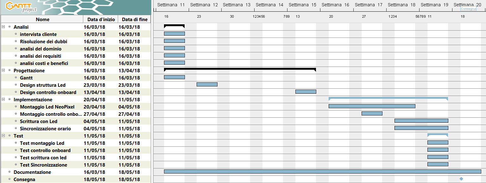

# Word Clock

1. [Introduzione](#introduzione)

    -   [Informazioni sul progetto](#informazioni-sul-progetto)

    -   [Abstract](#abstract)

    -   [Scopo](#scopo)

2. [Analisi](#analisi)

    - [Analisi del dominio](#analisi-del-dominio)

    - [Analisi e specifica dei requisiti](#analisi-e-specifica-dei-requisiti)

    - [Analisi dei costi](#analisi-dei-costi)

    - [Pianificazione](#pianificazione)

    - [Analisi dei mezzi](#analisi-dei-mezzi)

3. [Progettazione](#progettazione)

    - [Design dell’architettura del sistema](#design-dell’architettura-del-sistema)

    - [Design dei dati e database](#design-dei-dati-e-database)

4. [Implementazione](#Implementazione)

    - [Sviluppo](#Sviluppo)

    - [Test](#Test)

    - [Protocollo di test](#Protocollo-di-test)

    - [Risultati test](#Risultati-test)

    - [Mancanze/limitazioni conosciute](#Mancanze/limitazioni-conosciute)

5. [Consuntivo](#Consuntivo)

6. [Conclusioni](#Conclusioni)

    - [Sviluppi futuri](#Sviluppi-futuri)

    - [Considerazioni personali](#Considerazioni-personali)

7. [Bibliografia](#Bibliografia)

    - [Sitografia](#Sitografia)

8. [Allegati](#Allegati)

## Introduzione
### Informazioni sul progetto

Scuola SAMT - Scuola arti e mestieri Trevano

Sezione: Informatica

Materia: Modulo 306

Allievi:

- Fabio Gola
- Alessandro Gomes

Docente responsabile:

- Adriano Barchi

Data di inizio: 16.03.2017

Data di fine: 18.05.2017

### Abstract

> You don't know what time is it, but you don't have a clock?
> This clock represented by words is here for you.
> We created a simple and clean design for give you an easy
> and fast read of it.
> In this way you don't have anymore the need to ask it to anybody else.
> This WordClock won't be the helpful clock that you may need, but it will
> surely be the greatest and coolest you have ever seen!
> Anywhere you'll put it will always be gorgeous to look at.

### Scopo

> Lo scopo del progetto è quello di realizzare un orologio a parole. Questo dovrà
> essere costruito in un modello fisico. In questo modello fisico verrà mostrata
> l'ora scritta con delle parole retroilluminate tramite una striscia di led 
> NeaoPixel controllata da un'Arduino che sarà sempre collegato ad un time server
> tramite Wi-Fi in modo tale che sia sempre sincronizzato con l'ora del server.

## Analisi

### Analisi del dominio

> Con la tecnologia si fanno sempre più progressi, per questo con il tempo
> gli orologi analogici non verranno più utilizzati.
> L'utilizzo del digitale sta avendo il soppravento e quindi per le strade o
> nelle strutture come case ed uffici possiamo trovare un orologio numerico.
> Il prodotto comprende una lettura diversa dal solito poiché l'ora verrà espressa
> a parole, questo sarà accessibile a chiunque.

### Analisi e specifica dei requisiti

|ID  | REQ-001                                         |
|:----|:------------------------------------------------|
|**Nome**    |Realizzare un applicativo che mostri l'ora corrente |
|**Priorità** | 1                     |
|**Versione** | 1.0                   |
|**Note**    | |
|            |**Sotto requisiti** |
|**001**  | L’orologio dovrà mostrare le ore in lingua italiana  |
|**002**  | Il sistema di accenzione delle parole verra implementato utilizzando un Led stripes NeoPixel   |

|ID  |REQ-002                                         |
|:----|:------------------------------------------------|
|**Nome**    |Connessione wi-fi |
|**Priorità** |1                     |
|**Versione** |1.0                   |
|**Note**    ||
|            |**Sotto requisiti** |
|**001**  | La connessione verrà eseguita autonomamente|
|**002**  | Ritornerà l'orario aggiornato rispetto il meridiano di Greenwich  |

|ID  |REQ-003                                         |
|:----|:------------------------------------------------|
|**Nome**    |Alimentazione |
|**Priorità** |1                     |
|**Versione** |1.0                   |
|**Note**    ||
|            |**Sotto requisiti** |
|**001**  | L'orologio verrà alimentato autonomamente |
|**002**  | In caso di interruzione verrà alimentato tramite una batteria esterna |
|**003**  | La batteria esterna permetterà di mantenere l'orario aggiornato |

|ID  |REQ-004                                         |
|:----|:------------------------------------------------|
|**Nome**    |Controllo OnBoard |
|**Priorità** |1                     |
|**Versione** |1.0                   |
|**Note**    ||
|            |**Sotto requisiti** |
|**001**  | L'orologio dovrà poter essere controllato direttamente onboard |
|**002**  | Il primo controllo sarà per l'accensione |
|**003**  | Il secondo controllo sarà per la correzione dell'ora |

### Analisi dei costi

#### Costo per persona:

È stimato che un apprendista al nostro stesso livello guadagni circa 50 franchi all`ora.

|Costo per ora:    |Ore        |Totale        |
|------------------|-----------|--------------|
|50                |64         |3200 fr.      |

#### Costo totale (dipendenti):

Essendo due persone a lavorare in questo progetto, i costi vanno moltiplicati.

|Costo per ora   |Ore   |persone  |Totale     |
|----------------|------|---------|-----------|
|50 fr./h        |64    |2        |6400 fr.   |

#### Costo materiali:

|Materiale       |Costo|
|----------------|-----|
|                |     |
|----------------|-----|
|Totale:         |     |

#### Costo totale:

Facendo una somma dei vari totali arriviamo al costo totale finale di questo progetto.

|Totale          |
|----------------|
|                |

### Pianificazione

### Analisi dei mezzi

Questo prodotto sarà compreso in un costrutto di legno per il modello fisico, ed in un web server per il modello virtuale.

I mezzi software per realizzare il progetto sono i seguenti:

- GanttProject 2.8.5, software utilizzato per sviluppare il diagramma di Gantt

- Fritzing 0.9.3b, utilizzato per la creazione degli schemi elettrici

- Arduino 2.8.5, utilizzato per gestire l'Arduino uno

I mezzi software per realizzare il progetto sono i seguenti:

- Arduino uno, serve per eseguire lo script ed attivare i NeoPixels

- I nostri PC per realizzare tutte le fasi del progetto

- I LED Stripes NeoPixel 1m 144 LEDS
