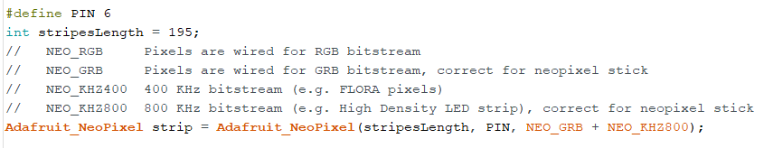

# Word-Clock

1. [Introduzione](#introduzione)

    -   [Informazioni sul progetto](#informazioni-sul-progetto)

    -   [Abstract](#abstract)

    -   [Scopo](#scopo)

2. [Analisi](#analisi)

    - [Analisi del dominio](#analisi-del-dominio)

    - [Analisi e specifica dei requisiti](#analisi-e-specifica-dei-requisiti)

    - [Analisi dei costi](#analisi-dei-costi)

    - [Pianificazione](#pianificazione)

    - [Analisi dei mezzi](#analisi-dei-mezzi)

3. [Progettazione](#progettazione)

    - [Design dell’architettura del sistema](#design-dellarchitettura-del-sistema)

    - [Design dell’architettura fisica](#design-dellarchitettura-fisica)

    - [Design schemi elettrici](#design-schemi-elettrici)

4. [Implementazione](#implementazione)

    - [Sincronizzazione orario](#sincronizzazione-orario)

    - [Gestione illuminazione WordClock](#gestione-illuminazione-wordclock)

5. [Test](#test)

	- [Protocollo di test](#protocollo-di-test)

    - [Risultati test](#risultati-test)

    - [Mancanze conosciute](#mancanze-conosciute)

6. [Consuntivo](#consuntivo)

7. [Conclusioni](#conclusioni)

    - [Sviluppi futuri](#sviluppi-futuri)

    - [Considerazioni personali](#considerazioni-personali)

8. [Bibligrafia](#bibligrafia)

    - [Sitografia](#sitografia)

9. [Allegati](#allegati)

## Introduzione

### Informazioni sul progetto

Scuola SAMT - Scuola arti e mestieri Trevano

Sezione: Informatica

Materia: Modulo 306

Allievi:

- Fabio Gola
- Alessandro Gomes

Docente responsabile:

- Adriano Barchi

Data di inizio: 16.03.2017

Data di fine: 18.05.2017

### Abstract

> You don't know what time is it, but you don't have a clock?
> This clock represented by words is here for you.
> We created a simple and clean design for give you an easy
> and fast read of it.
> In this way you don't have anymore the need to ask it to anybody else.
> This WordClock won't be the helpful clock that you may need, but it will
> surely be the greatest and coolest you have ever seen!
> Anywhere you'll put it will always be gorgeous to look at.

### Scopo

> Lo scopo del progetto è quello di realizzare un orologio a parole. Questo dovrà
> essere costruito in un modello fisico. In questo modello fisico verrà mostrata
> l'ora scritta con delle parole retroilluminate tramite una striscia di led 
> NeaoPixel controllata da un'Arduino che sarà sempre collegato ad un time server
> tramite Wi-Fi in modo tale che sia sempre sincronizzato con l'ora del server.

## Analisi

### Analisi del dominio

> Con la tecnologia si fanno sempre più progressi, per questo con il tempo
> gli orologi analogici non verranno più utilizzati.
> L'utilizzo del digitale sta avendo il soppravento e quindi per le strade o
> nelle strutture come case ed uffici possiamo trovare un orologio numerico.
> Il prodotto comprende una lettura diversa dal solito poiché l'ora verrà espressa
> a parole, questo sarà accessibile a chiunque.

### Analisi e specifica dei requisiti

|ID  | REQ-001                                         |
|:----|:------------------------------------------------|
|**Nome**    |Realizzare un applicativo che mostri l'ora corrente |
|**Priorità** | 1                     |
|**Versione** | 1.0                   |
|**Note**    | |
|            |**Sotto requisiti** |
|**001**  | L’orologio dovrà mostrare le ore in lingua italiana  |
|**002**  | Il sistema di accenzione delle parole verra implementato utilizzando un Led stripes NeoPixel   |

|ID  |REQ-002                                         |
|:----|:------------------------------------------------|
|**Nome**    |Connessione wi-fi |
|**Priorità** |1                     |
|**Versione** |1.0                   |
|**Note**    ||
|            |**Sotto requisiti** |
|**001**  | La connessione verrà eseguita autonomamente|
|**002**  | Ritornerà l'orario aggiornato rispetto il meridiano di Greenwich  |

|ID  |REQ-003                                         |
|:----|:------------------------------------------------|
|**Nome**    |Alimentazione |
|**Priorità** |1                     |
|**Versione** |1.0                   |
|**Note**    ||
|            |**Sotto requisiti** |
|**001**  | L'orologio verrà alimentato autonomamente |
|**002**  | In caso di interruzione verrà alimentato tramite una batteria esterna |
|**003**  | La batteria esterna permetterà di mantenere l'orario aggiornato |

|ID  |REQ-004                                         |
|:----|:------------------------------------------------|
|**Nome**    |Controllo OnBoard |
|**Priorità** |1                     |
|**Versione** |1.0                   |
|**Note**    ||
|            |**Sotto requisiti** |
|**001**  | L'orologio dovrà poter essere controllato direttamente onboard |
|**002**  | Il primo controllo sarà per l'accensione |
|**003**  | Il secondo controllo sarà per la correzione dell'ora |

### Analisi dei costi

#### Costo per persona:

È stimato che un apprendista al nostro stesso livello guadagni circa 60 franchi all`ora.

|**Costo per ora**|**Ore**|**Totale**|
|-----------------|-------|----------|
|60  fr/h         |72     |4320 fr.  |

#### Costo totale (dipendenti):

Essendo due persone a lavorare in questo progetto, i costi vanno moltiplicati.

|**Costo per ora**|**Ore**|**Persone**|**Totale**|
|-----------------|-------|-----------|----------|
|60  fr/h         |72     |2          |8640 fr.  |

#### Costo materiali:

|**Materiale**                      |**Costo** |
|-----------------------------------|----------|
|DCF77 RTC                          |12.94 fr. |
|Led stripes NeoPixel 5m 66 Leds X 2|137.62 fr.|
|Arduino Uno                        |23.73 fr. |
|Totale:                            |174.29 fr.|

#### Costo totale:

Facendo una somma dei vari totali arriviamo al costo totale finale di questo progetto.

|Totale          |
|----------------|
|8814.29 fr.     |

### Pianificazione

### Analisi dei mezzi

I mezzi software per realizzare il progetto sono i seguenti:

- GanttProject 2.8.5, software utilizzato per sviluppare il diagramma di Gantt

- Fritzing 0.9.3b, utilizzato per la creazione degli schemi elettrici

- Arduino 2.8.5, utilizzato per gestire l'Arduino uno

I mezzi software per realizzare il progetto sono i seguenti:

- Arduino uno, serve per eseguire lo script ed attivare i NeoPixels

- I nostri PC per realizzare tutte le fasi del progetto

- I LED Stripes NeoPixel 1m 144 LEDS

## Progettazione

### Design dell’architettura del sistema

Questo progetto é composto da una struttura fisica suddivisa in una griglia di quadrati 13 X 14.
All'interno di ogniuno di essi saranno presenti due Led, questi Led fanno parte di una striscia
di Led NeoPixel 1m 66 Leds. Posta sopra questa griglia c'é un foglio con parole retroilluminate
che rappresentano il WordClock. Per permettere che l'ora sia sempre giusta c'é un controllo
onboard che serve, per accenderlo, per modificare l'ora e, tramite un RTC alimentato anche da
una batteria indipendente, tenerlo sempre sincronizzato con l'orario corrente.

### Design dell’architettura fisica

Nell'immagine sovrastante è rappresenatato la versione fisica del Word Clock,
nelle varie celle verranno visualizzate le lettere necessarie. Le misure prese
sono quelle imposte nel mandato. Il contenitore è composto principalmente di
compensato a parte le sue separazioni all'interno che sono di policarbonato,
quest'ultimo è stato usato per rendere il tutto più flessibile in modo da
prevenire eventuali incidenti.

In immagine viene mostrato, nello specifico, l'altezza e lo spessore
della parte superiore del supporto, le misure sono visibili nell'immagine.

Qua viene rappresentato tutto il contenitore, in cui e ben visibile lo spazio
sottostante che ospiterà la scheda Arduino, le due Veroboard e l'alimentatore.

### Design schemi elettrici

#### Schema elettrico antenna DCF77

Questo é lo schema elettrico dell'antenna dcf77, questo schema serve per testare se l'antenna riceve un
segnale e a che frequenza lo riceve. Questo montaggio può essere eseguito anche senza condensatore C1.

#### Schema elettrico led stripes

Questo è lo schema elettrico dei led stripes, i led devono essere collegati direttamente all'alimentatore
ed inoltre un pin deve essere collegato all'arduino, così da poter gestire l'accensione di ogni led della
striscia.

#### Schema elettrico controllo on board

Questo è lo schema elettrico del controllo on board del WordClock, l'idea era quella di poter accendere,
spegnere e modificare l'ora a proprio piacimento tramite questo montaggio.

## Implementazione

### Sincronizzazione orario

#### FrancoforteClock.ino

Questo programma é quello che abbiamo utilizzato per testare e gestire la sincronizzazione tramite
l'antenna DCF77 all'orario di Mainflingen, località nei pressi di Francoforte ed in cui é situato
il trasmettitore DCF77. Questo codice di base é stato preso dal sito ufficiale di Arduino, per
utilizzarlo però abbiamo dovuto scaricare delle librerie che per la gestione del componente.
Le librerie che abbiamo utilizzato effettivamente sono le seguenti due.

Queste due librerie le abbiamo inserite nel seguente percorso: _C:\Program Files (x86)\Arduino\libraries_.

In seguito abbiamo dovuto creare tutte le variabili per gestire sia le "informazioni" in entrata sia
tutte le "informazioni", una volta "lavorate" all'interno del codice, in uscita.

All'interno del metodo loop() é presente un controllo che verifica se effettivamente l'antenna DCF77
é riuscita a collegarsi all'orario di Francoforte "if(DCFtempo!=0)" il quale controlla se l'orario 
che é contenuto all'interno della variabile _DCFtempo_ sia diverso da 0. In caso l'orario sia diverso
da 0 allora vuole dire che l'antenna si é sincronizzata con successo e quindi stampa l'orario a terminale.
Una volta stampato l'orario a terminale lo vado a settare all'interno della libreria _"TimeLib.h"_ in modo
tale da potere prendere i vari "pezzi" dell'orario nel metodo _digitalClockDisplay()_.

I metodi _digitalClockDisplay()_ e _printDigits(int digits)_ servono per gestire la stampa a terminale del tempo suddiviso in:
ore, minuti, secondi, giorni, mesi e anni.

### Gestione illuminazione WordClock

#### Montaggio led stripes

Inizialemnte abbiamo dovuto vedere, in base alla grandezza della griglia del modello fisico (13x15), quale fosse il verso
in cui ci sarebbero stati più led in una singola cella. Alla fine, dopo alcuni test, abbiamo ottato per montare le strisce
di led sulle colonne della griglia con il seguente schema dei led: 3 led, _taglia_, 4 led, _taglia_, 3 led, _taglia_, 3 led,
_taglia_. In questo modo siamo riusciti a montare tutti i led senza che nessuno di essi andasse sotto le "pareti" della
griglia di compensato e di conseguenza non si vedesse quando illuminato o illuminasse due celle diverse.

In seguito abbiamo anche dovuto praticare un foro sulla struttura esterna, in modo tale da fare passare i cavi che collegeranno
la striscia di led neopixel all'Arduino.

#### Illuminazione led stripes

Inizialmente abbiamo dovuto capire il funzionamento delle led stripes e lo abbiamo capito tramite un semplice esempio di codice.
Innanzitutto é necessario scaricare le librerie seguenti.

In seguito abbiamo dovuto creare la variabile per definire il PIN d'uscita del segnale per il controllo delle stripes, la variabile
contenente la lunghezza della striscia (misurata con il numero totale dei led presenti su di essa) e infine abbiamo creato una 
variabile che servirà per la gestione dell'accensione dei vari led.

All'interno del motodo setup() inizializziamo la striscia di led neopixel, impostiamo la luminosità dei led e li "visualizziamo"
tramite il metodo _strip.show()_.

All'interno del metodo loop() ci va un semplice ciclo for che continuerà a "ciclare" fino alla lunghezza totale della striscia
di led. All'interno di questo ciclo c'é un semplicissimo metodo, a cui passeremo il numero del led e la tonalità del colore
tramite una combinazione rgb.

## Test

### Protocollo di test

### Risultati test

### Mancanze conosciute

## Consuntivo

## Conclusioni

### Sviluppi futuri

### Considerazioni personali

## Bibligrafia

### Sitografia

## Allegati